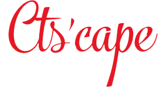

  
  
<i>Projet T4 - Martin Monteil, William Guthmann, Mikail Kocak</i>

  
  
<strong><big>Apprenez le vocabulaire des transports en commun strasbourgeois tout en jouant !</big></strong> 
     <i>Learn the French public transports vocabulary through playing!</i>

  
&nbsp; <!-- bottom margin -->

## Téléchargement et Installation

  Vous retrouverez la dernière version en téléchargement pour Windows (seulement)
  <a href='https://git.unistra.fr/wguthmann/scl19-t4-d/tags'>ici</a>.

  .

## Développement
### Prérequis
- Un système Windows 7 ou supérieur ;
- [.NET Framework 4.6.1](https://www.microsoft.com/en-us/download/details.aspx?id=49981) ;
- [Visual Studio 16.0 (2017) ou supérieur](https://visualstudio.microsoft.com/downloads/).

  
  &nbsp;
  
  &nbsp;
  

### Installation
1. Cloner `git@git.unistra.fr:wguthmann/scl19-t4-d.git` ;
1. Lancer la solution du projet [`CTScape/CTScape.sln`](CTScape/CTScape.sln).
